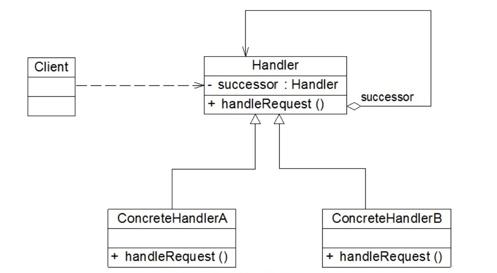

### 责任链模式汇总总结	学习难度：★★★☆☆，使用频率：★★☆☆☆ 

---

* **前言**

  我们的系统经常会遇到像审批系统这样的操作，较小的金额由低级别的员工审批，较大的金额由高级别的员工审批，有时我们通过if else的方式去处理这种问题，但是这样会使代码比较臃肿且不符合开闭原则，所以有没有一种更好的解决方案去处理这样的问题

* **定义**

  责任链模式（Chain of Responsibility Pattern）:将请求发送者和请求接受者解耦，让请求的接受者形成链式操作，所有人都能够接受接受到请求，直到有人处理请求，责任链模式是一种对象行为模式。

* **UML**

  

* **角色与过程**

  * Handler（抽象处理者）：所有具体处理者的父类，一般定义为抽象类，定义了一个统一的处理入口，以及维持了一个抽象处理者类型对象的引用，用于形成链式处理者
  * Concrete Handler（具体处理者）：继承抽象处理者，实现统一的处理入口，将自己无法处理的请求转发给下一个处理者
  * 处理链的形成是在客户端完成的，以及处理链的顺序也是客户端决定的

* **纯的责任链模式**

  * 处理者只有两种选择，要么全部处理请求，要么全部不处理，不能只处理一部分请求
  * 请求必须被处理，不存在请求最终未被处理的情况发生

* **不纯的责任链模式**

  * 可以处理部分，然后将请求转发给下一个处理者处理
  * 请求可以不被所有处理者处理

* 优点

  降低系统耦合度，请求者只用知道请求会被处理，方便处理者的增加、减少、调换顺序

* 缺点

  系统复杂度提高，如果建链时操作不当可能会引起请求未被处理或者死循环

* 适合场景

  系统中存在多个对象处理同一个请求。
