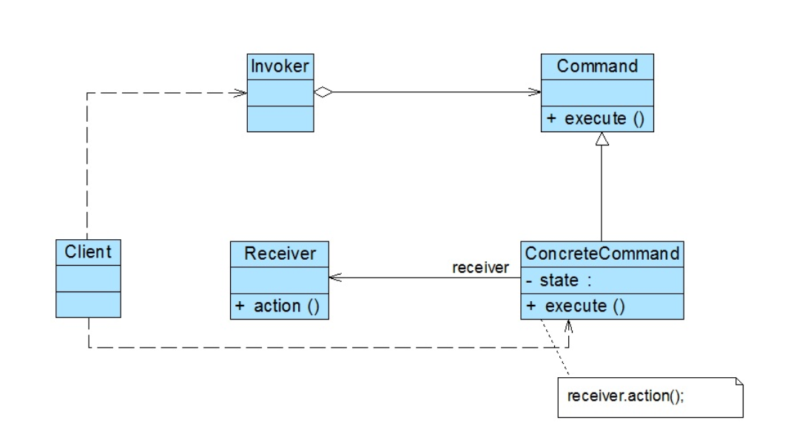

### 命令模式汇总总结	学习难度：★★★☆☆，使用频率：★★★★☆  

---

* **前言**

  我们的系统中存在这样一种场景，我们作为请求的发送者我们不想和请求的接收者与处理者进行直接耦合，那么我们有什么比较好的解决方案去处理这样场景下的问题，而且这些请求的处理者没有共同特征，不能够使我们进行抽象处理，所以我们对请求的接受者进行两层处理，一层是对请求的接受者进行封装以提供统一的请求入口，另外一层是对封装后的对象进行抽象处理，使客户端面对抽象编程。

* **定义**

  命令模式（Command Pattern）：将一个请求封装为一个对象，从而让我们可用不同的请求对客户进行参数化；对请求排队或者记录请求日志，以及支持可撤销的操作。命令模式是一种对象行为型模式，其别名为动作(Action)模式或事务(Transaction)模式。 
  
* **UML**

  

* **角色与过程**

  * Command（抽象命令类）：所有具体命令类的父类，一般定义为抽象类或者接口，声明执行请求的execute()方法等。
  * Concrete Command（具体命令类）：继承抽象命令类，持有接收者的引用，在execute()等方法中调用接收者的方法已完成业务的处理。
  * Invoker（调用者）：调用者即请求发送者，通过命令对象执行请求
  * Receiver（接收者）：请求的最终执行者
  * 具体命令类对接收者进行封装，抽象命令类对具体命令类进行抽象，客户端面向抽象命令类编程

* **命令队列的实现**

  新增CommandQueue类，由该类来负责存储多个命令对象，执行CommandQueue类中对应的方法时，循环调用内部存储的多个命令对象
  
* **撤销操作与请求日志的实现**

  存储执行的命令，以便进行查询每一步进行的记录

* **宏命令**

  宏命令又称为组合命令，是组合模式与命令模式的结合，宏命令是一个具体命令类，其拥有一个集合属性，该集合属性中包含着其他命令对象的引用，其他命令对象又有可能包含着其他命令对象的引用，执行宏命令实际上执行的是它包含的全部子命令，以实现批处理

* 优点

  * 降低系统耦合度，新的命令可以很容易的加入到系统中，为请求的撤销和恢复实现了一种可行方案

* 缺点

  * 系统中具体命令类数量增多

* 适合场景

  * 请求者与接收者解耦
  * 系统需要在不同的时期指定请求、将请求排队和执行请求
  * 系统需要做撤销和恢复操作
  * 系统需要执行一组命令
