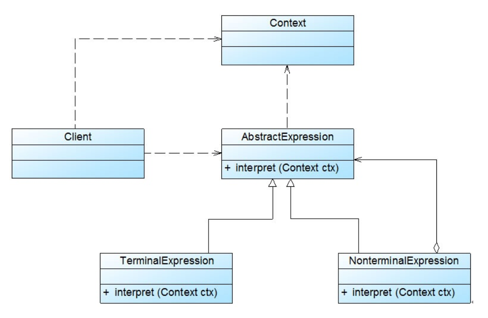

### 解释器模式汇总总结	学习难度：★★★★★，使用频率：★☆☆☆☆  

---

* **前言**

  基于面向对象语言创建的自定义语言，可以使用解释器模式进行解释。

* **定义**

  解释器模式（Interpreter Pattern）：定义一个语言的文法，并创建一个解释器去解释该语言中的句子，这里的“语言”是指使用规定格式和语法的代码。解释器模式是一种类行为型模式 。 
  
* **UML**

  

* **角色与过程**

  * Abstract Expression（抽象表达式）：终结符表达式与非终结符表达式的共同父类，声明了抽象的解释行为。
  * Terminal Exception（终结符表达式）：抽象表达式的子类，包含文法中终结符的解释操作。
  * Nonterminal Exception（非终结符表达式）：抽象表达式的子类，实现了文法中非终结符的解释操作，内部包含非终结符表达式或者终结符表达式。
  * Context（环境类）：上下文环境
  * 终结符表达式是“一句话”中包含的所有最终解释单元，非终结符表达式将一组终结符表达式连接，完成“一句话”的解释，非终结符表达式将“几句话”连接，完成一段话的解释。

* **优点**

  * 易于改变和扩展文法

* **缺点**

  * 复杂文法难以维护，执行效率的

