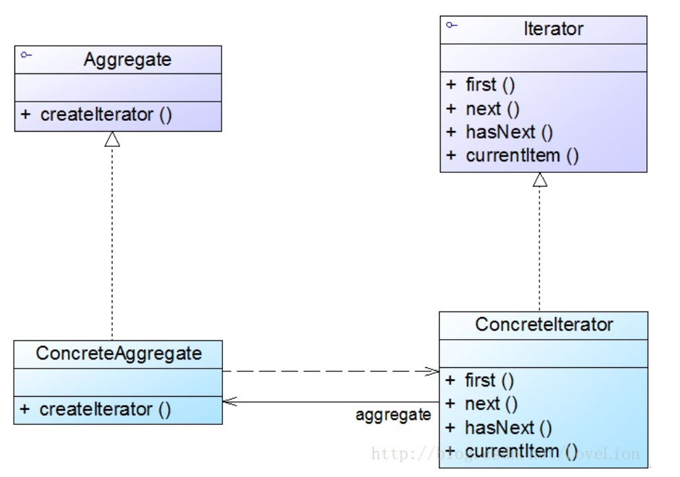

### 迭代器模式汇总总结	学习难度：★★★☆☆，使用频率：★★★★★  

---

* **前言**

  迭代器是我们日常开发中经常遇到的设计模式，尤其是聚合对象的使用，聚合对象有两种职责，一是存储数据，二是遍历数据，前者是基本职责，后者是可变化的且可分离的，将后者分离出来更符合“单一职能原则”。

* **定义**

  迭代器模式（Iterator Pattern）：提供一种方法来访问聚合对象中的元素，而不用暴露聚合对象的内部表示，其别名为游标（cursor）,它是一种对象行为型模式。 
  
* **UML**

  

* **角色与过程**

  * Iterator（抽象迭代器）：它定义了访问和遍历元素的接口，声明了用于遍历数据元素的方法
  * Concrete Iterator（具体迭代器）：实现抽象迭代器，实现了遍历元素数据的方法，通过内部游标（非负整数）的方式记录访问的位置
  * Aggregate（抽象聚合类）：存储和管理元素对象，声明了createIterator ()方法用于创建一个迭代器对象，充当抽象迭代器工厂角色
  * Concrete Aggregate（具体聚合类）：实现createIterator ()方法，返回一个与之对应的具体迭代器角色
  * 抽象迭代器与抽象聚合类只是声明接口，定义方法，具体聚合类调用具体迭代器构造函数创建具体迭代器，具体迭代器内部维持一个具体聚合类的引用。

* **内部类生成迭代器**

  具体聚合类内部声明具体迭代器类型的内部类，具体迭代器可以直接访问聚合对象的内部元素

* **优点**

  * 减轻聚合类职责，能够定义多种访问方法访问聚合类内部元素
  
* **缺点**

  * 抽象迭代器设计难度较大，例如JDK内置迭代器Iterator就无法实现逆向遍历，如果需要实现逆向遍历，只能通过其子类ListIterator等来实现，而ListIterator迭代器无法用于操作Set类型的聚合对象 
  
* 适用场景

  * 访问一个聚合对象的内容而无须暴露它的内部表示，且为多种类型的聚合对象提供统一入口
  * 需要为一个聚合对象提供多种遍历方式

