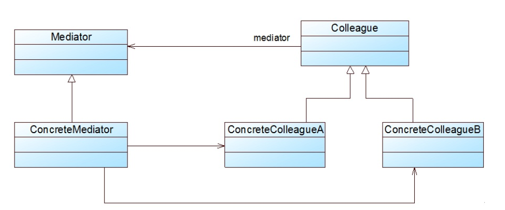

### 中介者模式汇总总结	学习难度：★★★☆☆，使用频率：★★☆☆☆  

---

* **前言**

  我们需要多个对象完成一系列的操作，一般的处理方式为直接将需要的对象引进来，这样各个类之间的耦合度大大增加，所以我们需要一个中介对象，在中介对象中持有所有对象的引用，并将一个事件中各个对象需要做的操作封装到一个操作中，我们需要完成的一系列操作直接调用中介对象封装的方法就可以了。

* **定义**

  中介者模式（Mediator Pattern）：提供一个中介者完成对一系列操作的封装，降低对象间的系统耦合度。中介者模式又称为调停者模式，它是一种对象行为型模式。 
  
* **UML**

  

* **角色与过程**

  * Mediator（抽象中介者）：声明具体中介者公共的方法，被抽象同事类所引用，供具体同事类适用
  * Concrete Mediator（具体中介者）：实现抽象中介者公共的方法，引用具体同事类完成一系列操作的封装
  * Colleague（抽象同事类）：声明公共方法，引用抽象中介者，供子类调用
  * Concrete Colleague（具体同事类）：实现公共方法，编写具体业务方法供具体中介者调用或者调用中介者中的方法。
  * 具体中介者引用具体同事类完成一系列操作的封装，被抽象同事类或者具体同事类调用

* **优点**

  * 对象间的网状结构转换为以中介者为中心的星状结构，降低对象间的耦合度
  
* **缺点**

  * 中介者类可能比较复杂
  
* **适用场景**

  * 系统中对象间存在复杂引用关心，且难以理解，想通过中间类完成多个对象的封装

