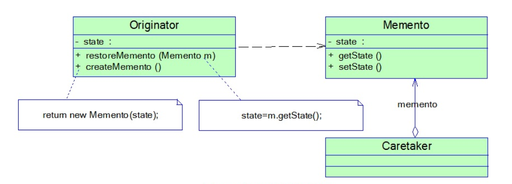

### 备忘录模式汇总总结	学习难度：★★☆☆☆，使用频率：★★☆☆☆  

---

* **前言**

  一句话我们想反悔，所以我们要存储某一刻的状态以便我们回滚到那个时候。

* **定义**

  备忘录模式（Memento Pattern）：在不破坏封装的前提下，捕获对象的内部状态，并在对象外存储这个内部状态，以便将来回滚到这一状态，它是一种对象行为型模式，其别名为Token。 
  
* **UML**

  

* **角色与过程**

  * Originator（原发器）：需要被记录状态的类
  * Memento（备忘录）：记录原发器状态的类，内部含有原发器的部分属性或者全部属性，不能被其他类所修改
  * Caretaker（管理者）：管理备忘录
  * 原发器创建备忘录记录此刻内部各属性的值，将备忘录交给管理者管理，回滚状态时，从管理者中获取备忘录，重置内部属性
  
* **优点**

  * 提供状态恢复机制
  
* **缺点**

  * 类对象太多，资源耗费过大
  
* **适用场景**

  * 状态恢复

