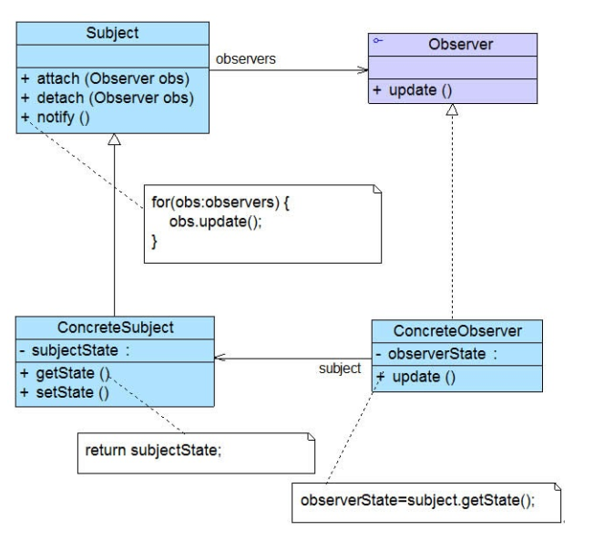

### 观察者模式汇总总结	学习难度：★★★☆☆，使用频率：★★★★★  

---

* **前言**

  一个对象状态或行为的变化，通知其它相关对象进行更新。

* **定义**

  观察者模式（Observer Pattern）：定义对象之间的一种一对多依赖关系，使得每一个对象发生状态的变化时，其相关依赖对象皆得到通知并被自动更新，又称为发布-订阅（Publish/Subscribe）模式、模型-视图（Model/View）模式、源-监听器（Source/Listener）模式或从属者（Dependence）模式。观察者模式是一种对象行为模式。
  
* **UML**

  

* **角色与过程**

  * Subject（目标类）：被观察的对象，内部定义一个观察者集合，并提供管理方法，定义通知方法notify()。
  * Concrete Subject（具体目标类）：继承目标类，实现notify中具体的方法，可省略。
  * Observer（观察者）：对目标类做出的变化进行反应，一般为接口，声明更新方法update()。
  * Concrete Observer（具体观察者）：继承观察者，一般持有指向具体目标类的引用，实现update方法，调用具体目标类完成具体的业务操作。
  * 首先对目标类和观察者进行抽象以便后期对程序进行扩展，目标类持有观察者的引用，实现自身变化时对观察者更新方法的调用。
  
* **优点**

  * 定义了稳定的消息传递机制，实现目标类与观察者的抽象耦合，支持广播通信，简化一对多设计难度。
  
* **缺点**

  * 观察者较多，花费时间较长、有可能存在循环依赖
  
* **适用场景**

  * 传递改变

