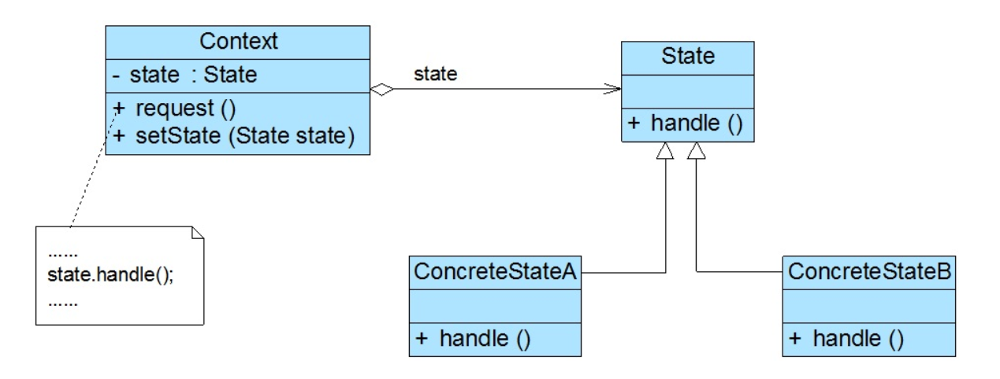

### 状态模式汇总总结	学习难度：★★★☆☆，使用频率：★★★☆☆  

---

* **前言**

  生活中银行卡，其行为如存款、取款、转账等行为受银行卡的状态的影响，普遍情况下方法中会存在大量的if...else...判断，这样会导致代码冗杂，维护性与扩展性较差。而状态模式就是为了解决系统中对象的状态转换与不同状态下行为的封装问题。

* **定义**

  状态模式（State Pattern）：复杂对象不同状态下的行为封装与状态转换，是一种对象行为模式。
  
* **UML**

  

* **角色与过程**

  * Context（上下文环境）：将自身的状态与行为分离出去，封装成状态类，持有抽象状态类的引用，根据自身属性变换更换具体状态类。
  * State（抽象状态类）：具体状态类的抽象，可以持有上下文环境的引用来更换状态。
  * Concrete State（具体状态类）：实现不同状态下的不同行为。
  * 上下文环境引用抽象状态类完成行为的调用，状态类的状态变化可以有上下文环境处理，也可以由状态类处理。
  * 状态类可以共享，像开关对象一样，可以被多个上下文环境引用。
  
* **优点**

  * 将特定行为封装起来，利于代码维护与理解，减少条件语句的使用。
  
* **缺点**

  * 增加系统中类的数量，增加系统开销、代码结构与实现较复杂、不符合开闭原则.
  
* **适用场景**

  * 代码中包含大量与对象状态有关的条件语句。

