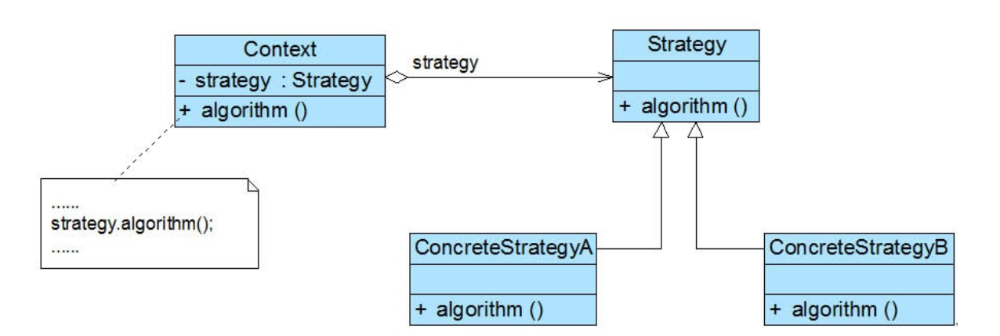

### 策略模式汇总总结	学习难度：★☆☆☆☆，使用频率：★★★★★  

---

* **前言**

  对同一个行为的不同表现进行抽象供客户端使用。

* **定义**

  策略模式（Strategy Pattern）：定义一系列算法，并将这些算法封装起来，并让他们能够相互替换，也称为政策模式（Policy），是一种对象行为模式。
  
* **UML**

  

* **角色与过程**

  * Context（上下文环境）：持有抽象策略类，调用策略方法。
  * Strategy（抽象策略类）：声明策略方法。
  * Concrete Strategy（具体策略类）：实现策略方法。
  * Context持有State的引用，完成对ConcreteStrategy中策略方法的调用。
  
* **优点**

  * 避免多重选择，代码复用，优化代码逻辑。
  
* **缺点**

  * 类的数量增多。
  
* **适用场景**

  * 隐藏细节，动态替换。

