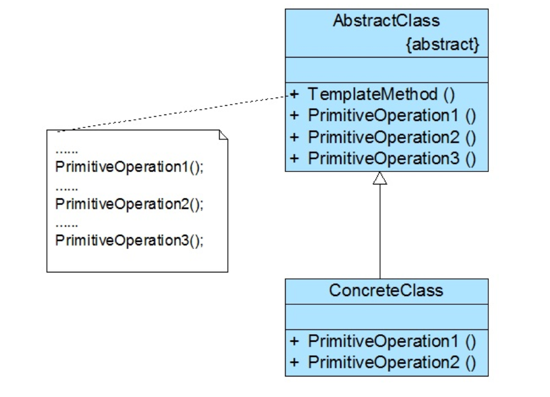

### 模板方法模式汇总总结	学习难度：★★☆☆☆，使用频率：★★★☆☆  

---

* **定义**

  模板方法模式（Strategy Pattern）：将一系列方法中的固定方法提取到抽象层，完成代码的复用，且通过子类的重写行为改变类的模板方法的功能的改变，是一种对象行为模式。
  
* **UML**

  

* **角色与过程**

  * Abstract Class（抽象类）：抽象类，提供默认实现的具体方法与供子类实现的抽象方法。
  * Concrete Class（具体子类）：实现父类声明的抽象方法，重写父类的逻辑。
  * 抽象类提供模板方法（包含基本方法的执行顺序，可被重写），里边包含具体方法（子类的通用方法），抽象方法（供子类重写的方法），钩子方法（供子类重写控制模板方法逻辑的方法），子类重写父类，使类具有不同的功能。
  
* **优点**

  * 代码复用，减少逻辑判断。
  
* **缺点**

  * 类的数量增多。
  
* **适用场景**

  * 公共行为提取，子类控制父类行为。

