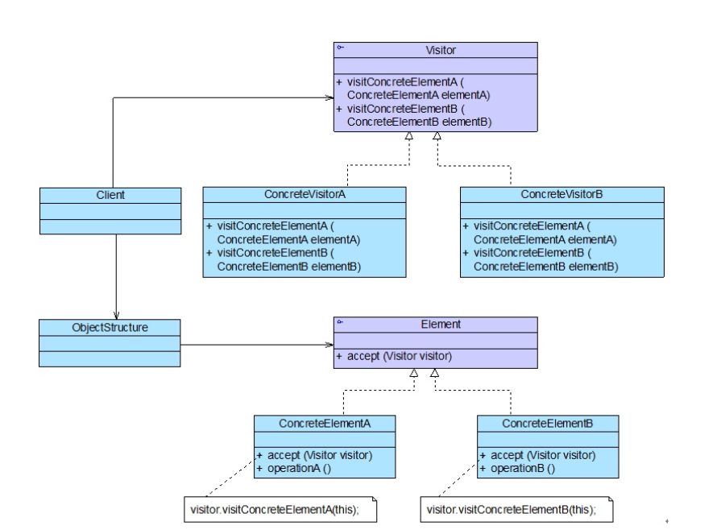

### 访问者模式汇总总结	学习难度：★★★★☆，使用频率：★☆☆☆☆  

---

* **前言**

  对于复杂对象的处理问题，很容易出现复杂的if...else...语句，对于不同的处理人，处理对象的方式也不相同，而访问者模式正是处理这种问题的一种比较好的解决方式。
  
* **定义**

  访问者模式（Visitor Pattern）：被访问对象放开胸怀，接受不同的访问者进行访问，且访问者对被访者数据进行处理，是一种对象行为模式。
  
* **UML**

  

* **角色与过程**

  * Visitor（抽象访问者）：内部声明一个对每一个具体元素进行访问的操作。
  * Concrete Visitor（具体访问者）：继承抽象访问者，实现对所有具体元素的一种访问操作。
  * Element（抽象元素）:声明accept()方法，以抽象访问者作为参数，供访问者访问。
  * Concrete Element（具体元素）:实现accept()方法，调用访问者的访问方法以完成访问者对自身的访问。
  * Object Structure（对象结构）:存储并管理元素，提供一个入口，使所有元素被访问。
  * 被访问者提供访问入口，使自身的数据被访问者访问。
  
* **优点**

  * 新增处理方式，只需要新增一个具体访问者就可以，层次清晰，新增访问者符合开闭原则。
  
* **缺点**

  * 新增具体元素不符合开闭原则，破坏封装，访问者直接进入被访者内部。
  
* **适用场景**

  * 一个对象包个类型的对象，并被不同处理。

