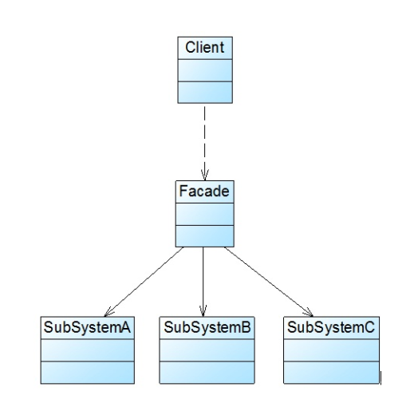

### 外观模式汇总总结	学习难度：★☆☆☆☆，使用频率：★★★★★ 

-------

* **前言**

  系统设计过程中，客户端直接调用多个子系统的方法，增加了客户端与系统的耦合度，对于系统的维护是非常不利的

* **定义**

  外观模式（Facade Pattern）：又称为门面模式，为子系统中一组接口提供一个统计的入口。外观模式定义了一个高层接口，方便了客户端与子系统之间的访问

* **UML**

  

* **角色与过程**

  * Facade（外观角色）：客户端调用子系统功能的入口，正常情况下，它将所有客户端发过来的请求委托给相应的子系统处理
  * SubSystem（子系统）：可以是一个类、一组类、一个模块或者是一个系统，可以被客户端直接调用或者被外观类调用。子系统并不知道外观的存在，对于它而言外观也是客户端

* **优点**

  * 降低了客户端与子系统间的耦合、减少关联对象的数量

* **缺点**

  * 限制客户端灵活性与可变性

* **适用场景**

  * 为访问一系列复杂的子系统提供一个简单的入口，将子系统与客户端解耦
