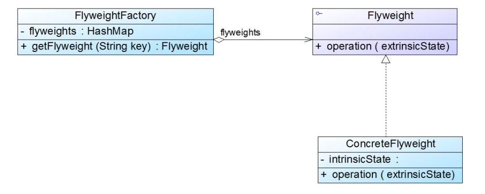

### 享元模式汇总总结	学习难度：★★★★☆，使用频率：★☆☆☆☆ 

-----

* **前言**

  在围棋系统中，棋子对象除了颜色不同外，其余属性完全相同，如果为每颗棋子都生成一个对象的话，完全是没有必要的，所以我们通过共享这些对象的方式来降低系统不必要的性能开销，存储这些对象的地方称为享元池（Flyweight Pool）。就像黑白色棋子一样这些对象存在内部状态（Intrinsic State）和外部状态（Extrinsic State），棋子本身为内部状态，棋子的颜色与棋子的坐标为外部状态。

* **定义**

  **享元模式**（Flyweight Pattern）：将系统中细粒度的相同的或者相似的对象以共享的方式存放在享元池中供客户端使用，它是一种对象结构型模式。

* **UML**

  

* **角色与过程**

  * Flyweight（抽象享元类）：通常是一个接口或者是抽象类，在抽象享元类中声明了共享享元类的公共方法，通过这些方法可以访问享元类的内部数据（内部状态），也可以设置享元类的外部数据（外部状态）
  * Concrete Flyweight（共享具体享元类）：实现抽象享元类，其实例称为享元对象，一般为单例模式，提供唯一的享元对象
  * UnsharedConcrete Flyweight（非共享具体享元类）：实现抽象享元类，但是不共享，通过构造函数进行实例化
  * Flyweight Factory（享元工厂类）：创建并管理享元对象，以内部的键值对结构存储享元对象
  * 共享具体享元类与非共享具体享元类实现抽象享元类，能够保证他们对外具有一致的行为接口，为客户端的使用提供了便利，客户端通过享元工厂类获取共享享元对象。
  * 享元工厂类返回的享元对象都是只有内部状态的享元对象，通过客户端操作添加外部状态

* **单纯享元模式**

  单纯享元模式：只包含共享具体享元对象的享元模式

  

* **复合享元模式**

  复合享元模式：将一些单纯享元类通过组合模式组合成复合享元模式，复合享元对象不可共享，复合享元对象中的单纯享元对象可以共享，复合享元对象的作用只是使包含的单纯享元对象具有相同的外部状态

  

* **注意事项**

  * 享元工厂类通过静态工厂方法返回享元对象，通过简单工厂模式生成享元对象
  * 共享享元类通过单例模式生成共享享元对象
  * 使用组合模式将单纯享元对象组合成复合享元对象

* **优点**

  减少内存中对象数量，节省内存开销

* **缺点**

  增加系统复杂度，将对象分为内部状态与外部状态

* **适用场景**

  一个系统中存在大量相同和相似的对象，对象内外部状态可以被轻易拆分
