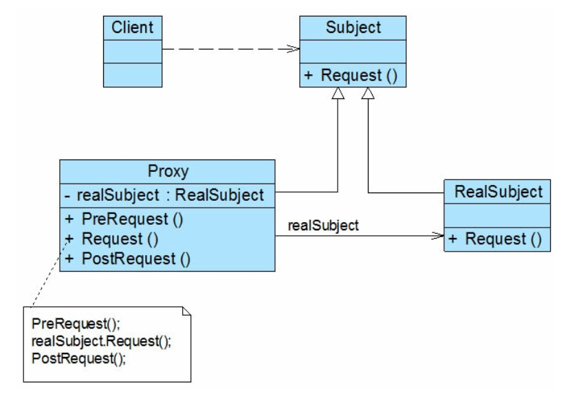

### 代理模式汇总总结 

----

* **前言**

  系统中当我们无法访问一个对象或者较为困难的访问一个对象时可以考虑使用代理对象来间接访问，为了保证客户端使用的透明性，真实对象和代理对象要实现同样的接口

* **定义**

  代理模式（Proxy Pattern）：通过一个代理对象或者占位符来控制对原对象的访问，它是一种对象结构型模式

* **UML**

  

* **角色与过程**

  * Subject（抽象主题角色）：真实主题角色与代理主题角色的共同父类，可以是具体类、抽象类、接口，客户端针对抽象主题角色编程
  * RealSubject（真实主题角色）：实现具体业务方法的类，被代理主题角色调用
  * Proxy（代理主题角色）：持有真实主题角色的引用，在调用真实主题角色的具体业务方法之前或者之后添加其它操作
  * 客户端面对抽象主题角色编程，调用抽象主题角色实际上调用的是代理主题角色，代理主题角色调用的是真实主题角色的方法，并在调用真实主题角色之前或者之后添加其他操作

* **常用代理模式介绍**

  * 远程代理（Remote Proxy）：为一个位于不同的地址空间的对象提供一个本地的代理对象
  * 虚拟代理（Virtual Proxy）：当需要创建一个比较耗费系统资源或者耗时较长的对象时，先创建一个比较小的对象替代它等真正需要使用时再创建
  * 保护代理（Protect Proxy）：控制对一个对象的访问，为不同级别的客户端提供不同级别的访问权限
  * 缓冲代理（Cache Proxy）：为某一个操作返回的结果提供临时存储空间，供多个客户端使用（缓存）
  * 智能引用代理（Smart Reference Proxy）：当一个对象被引用时，提供一些额外的操作，例如对象被调用的次数等

* **优点**

  降低调用者和被调用者的耦合度，提高系统灵活性和扩展性

* **缺点**

  增加系统复杂度
